# Livrables pour le TP - Cycle de vie de la donnée : de la source au Dashboard - 1ère Version du TP

*Formateur* : Mourad Elchyakhi

*Membres du groupe* : 

* Aymeric BOISGONTIER
* Dunvael LE ROUX

---

# Projet

## Objectifs

=> Simuler un projet data complet, de la découverte de la donnée brute à la création d'un Dashboard décisionnel, en intégrant les bonnes pratiques de modélisation (Médaillon) et de sécurité.

## Outils

OpenMetadata(image Docker complète seulement), PostgreSQL, Metabase.

## Scénario

Vous êtes Data Engineer/Analyst chez "VéloCity", une entreprise de location de vélos en libre-service. La direction Marketing souhaite un Dashboard pour suivre l'activité quotidienne : nombre de locations, durée moyenne des trajets, les vélos les plus utilisés, habitude par ville, âge des consommateurs, type d’abonnement pris, ... etc.

Lien GitHub docker : <https://github.com/mouradelchyakhi/enseignement_epsi/tree/main/tp_docker_light>

---

# Étapes du projet

## Partie 1 : Découverte et Compréhension (OpenMetadata ou fichier yaml)

***Objectif*** : Identifier les données sources pertinentes pour répondre aux besoins métiers.

### 1. Nous nous sommes connectés à l'instance OpenMetadata de "VéloCity"

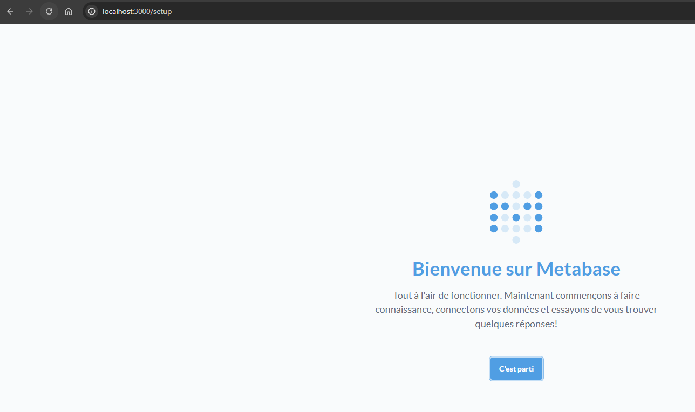
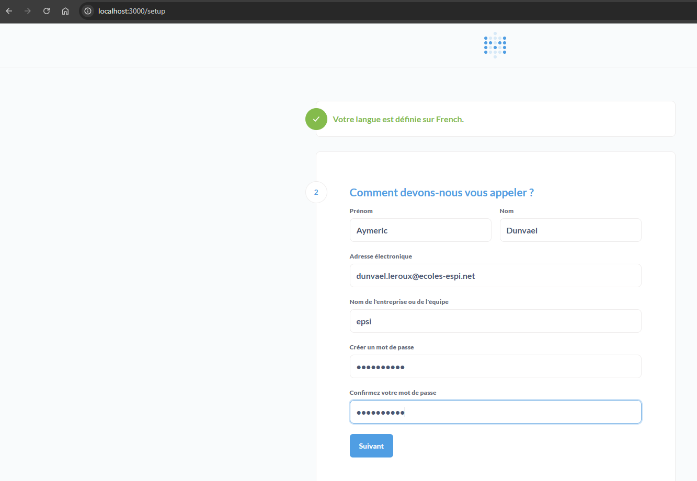
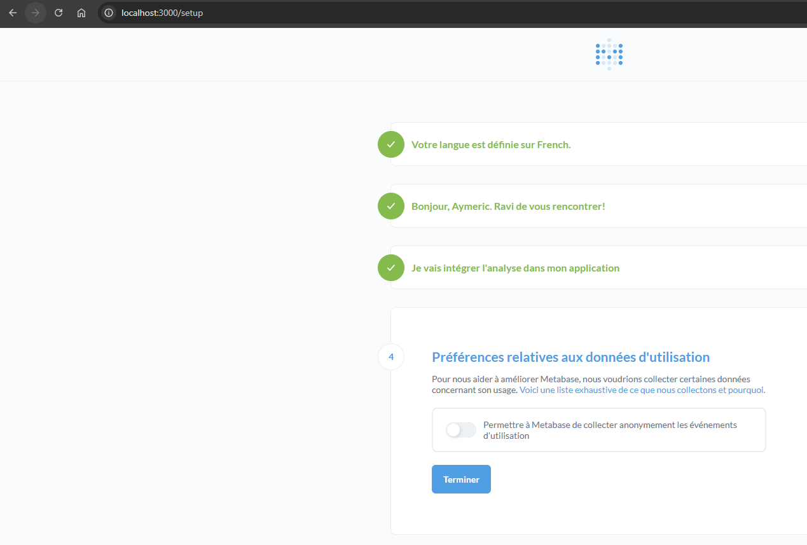

Nous avons ensuite ajouté la base de données :

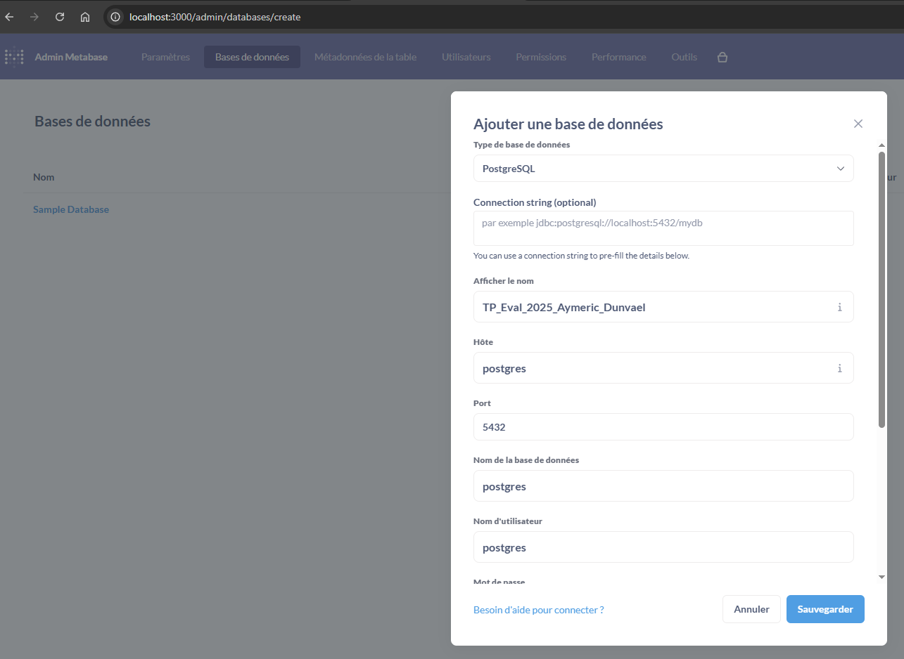
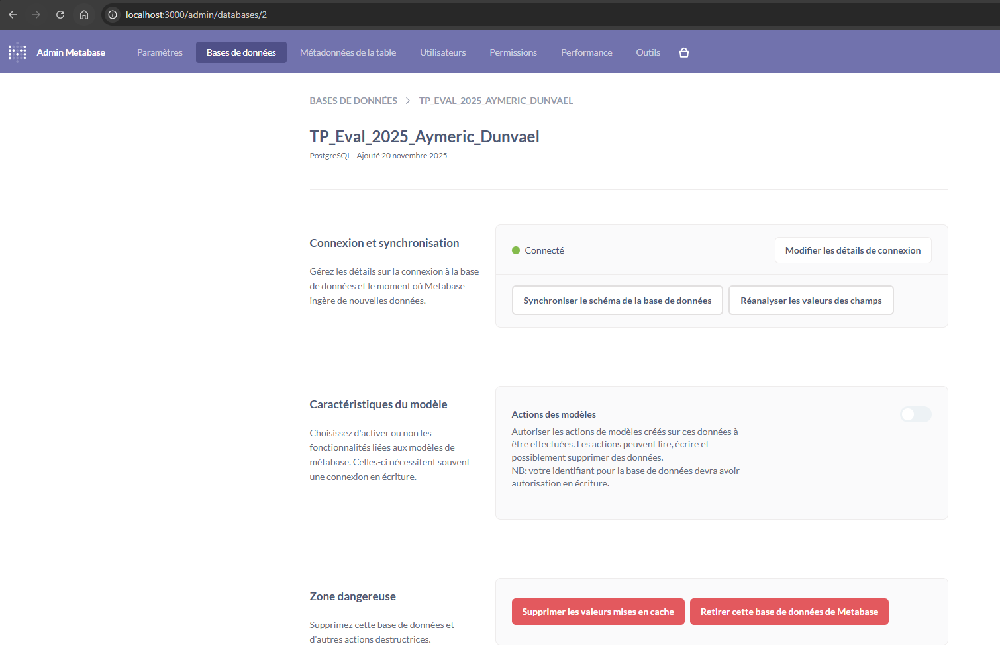

---

### 2. Exploration d'OpenMetadata

* Nous avons navigué dans le catalogue et identifié les tables qui semblent pertinentes pour ce TP.

* Nous avons utilisé la recherche et les "Tags" (ex: "Source", "PII") pour trouver les bonnes tables.  

### 3. Analyse des tables sur OpenMetadata

* Nous avons analysé (quand disponible) les schémas, documentations, profils de données et propriétaires.

### 4. Tables et faits pertinents

Après réflexion et analyse, nous sommes partis sur ces douze tables de données qui permettent de réaliser des dashboards complets et croisés :

<p align="center">
  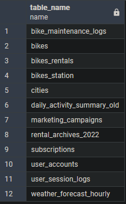
</p>

=> Avant de justifier les choix de tables et de déterminer s'il s'agit de tables de faits ou de dimensions, nous avons défini et synthétisé les cacarctéristiques d'une table de fait et d'une table de dimensions dans un tableau :

| **Aspect** | **Table de faits**   | **Table de dimensions**   |
| :--------: | :------------------: | :-----------------------: |
| Contenu    | Mesures, chiffres    | Descriptions, attributs   |
| Rôle       | Analyse quantitative | Contexte et qualification |
| Type       | Numérique            | Textuel / catégoriel      |
| Volume     | Très élevé           | Moyen / faible            |
| Fréquence d'ajout de lignes/données | Très élevée | Peu élevée |
| Exemple    | Montant des ventes   | Produit, magasin, client  |

*Il est possible d'avoir une table de faits et de dimensions associés*.

**Justification des tables et attribution Fait/Dimension :**

| **Tables** | **Données sélectionnés**   | **justification**   | **Faits** | **Dimensions** |  
| :---------: | :-------------------------: | :------------------: | :--------: | :-------------: |
| Bikes rentals | Nombre de locations / Start T - End T | Permet de déterminer les vélos les plus utilisés et leur temps d'utilisation et donc les préférences et besoins des utilisateurs sur les types de vélos | &#x2611;  |   |
| Bikes Station |  Station ID, Station Name, Capacity   | Permet de connaître les stations de vélos ainsi que leur capacité afin de déterminer quelles stations ont le plus de "succès", possibilité de lier les données avec les types de vélos et d'environnement (régions/villes...) | &#x2611;  |   |
| Bikes | Bike ID (type) et Status | Permet de cibler les vélos utilisés ou non dans les stations, possibilité de lier les données avec les stations mais aussi les locations de vélos (notamment selon leur type) | &#x2611; |   |
| Cities | City ID (city name), Regions | Permet de cibler les villes et régions où est présent VeloCity, possibilité de lier les données avec les stations, types de vélos, locations de vélos et par exemple de cibler les villes/régions les plus rentables et celles qui nécessitent plus de publicité |   | &#x2611;  |
| Daily activity summary old | Total rentals | Permet de calculer le taux de locations de vélos quotidiennes et de réaliser des comparatifs en liant les données avec les données météorologiques ou encore les campagnes marketing ou les types de vélos disponibles dans chaque station par exemple | &#x2611; |   |
| Marketings campaigns | Start date, End date | Permet de définir l'impact de la publicité sur le taux de location en liant les données avec le nombre de locations de vélos quotidiennes, leur début et fin de location par exemple | &#x2611; |   |
| Rental archives 2022 | Start T, End T, Bike ID | Permet d'observer l'historique des ventes d'une année à une autre et donc de déterminer l'évolution du marché dans les années à venir, possibilité de lier les données avec les campagnes marketing pour déterminer l'impact de la publicité sur les utilisateurs | &#x2611; |   |
| Subscriptions | Sub type, Sub ID | Permet de déterminer quels abonnements ont le plus de succès auprès des utilisateurs, possibilité de lier les données avec les villes/régions, avec les campagnes marketing ou encore le type d'utilisateur (différents profils utilisateurs pour différents besoins) | &#x2611; |   |
| User accounts | Birthdate, Sub ID | Permet de connaître le type de clientèle de VéloCity et de d'établir des profils utilisateurs selon les souscriptions et âge (clientèle plus agée, jeune, retraités ou employés...), possibilité de lier les données avec le type de souscription, le type de location, ... et de définir les préférences des clients par exemple | &#x2611; |   |
| User session logs | Device type | Permet de déterminer le type de connexion pour les locations (téléphone, web, ...) afin de comprendre les préférences d'interface des utilisateurs pour louer un vélo | &#x2611; |   |
| Bike maintenance logs | Bike ID  et Issue description | Permet de comprendre quel type de vélos est le plus âbimé, possibilité de lier les données avec les status de vélos par exemple | &#x2611; | &#x2611; |
| Weather forecast hourly |  Temperature Celsius, Precipitations Mm | Permet de déterminer le temps et l'impact des conditions météorologiques sur la location de vélos, possibilité de lier avec les données de locatins quotidienne, du temps de location d'un vélo, des villes et régions par exemple | &#x2611; | |

---

## Partie 2 : Modélisation et Transformation (PostgreSQL)

### 1. Connection à la base PostGreSQL

Nous nous sommes connectés à la base PostgreSQL avec pgAdmin.

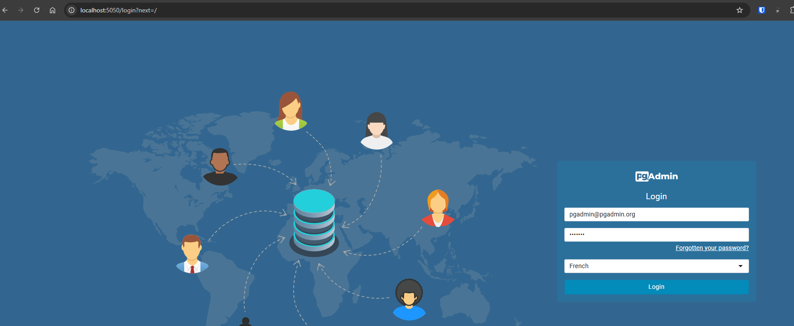
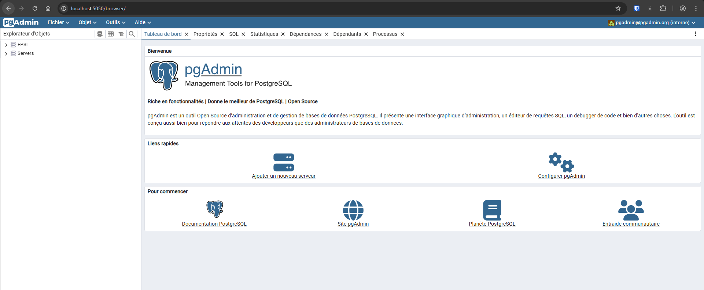
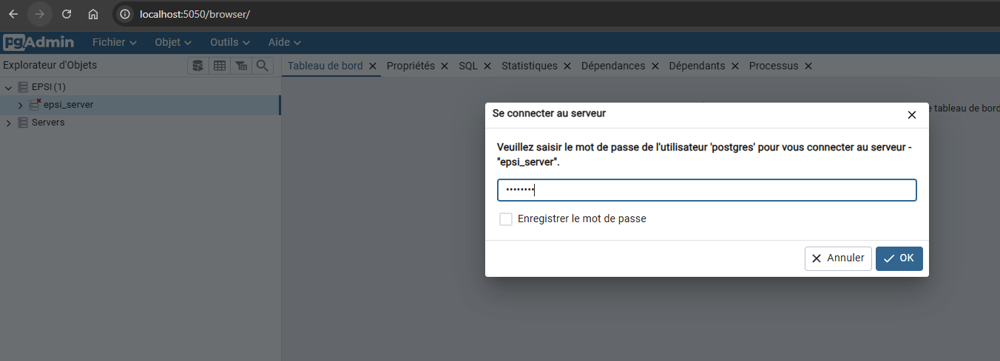
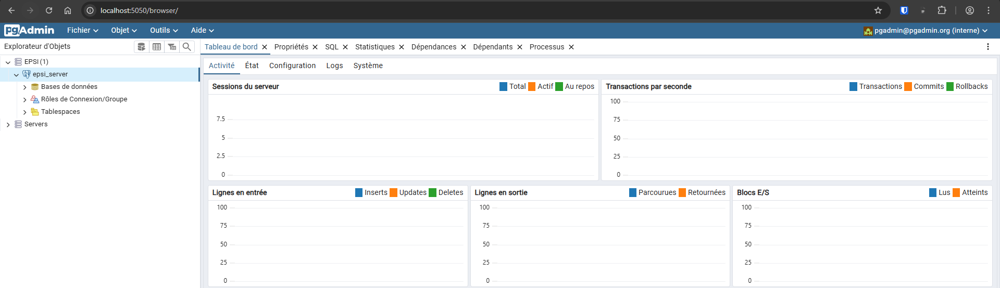


Nous trouvons les mêmes informations, la différence réside dans l'interface utilisateur (visuel et présentation).  

Exemple :

<p align="center">
  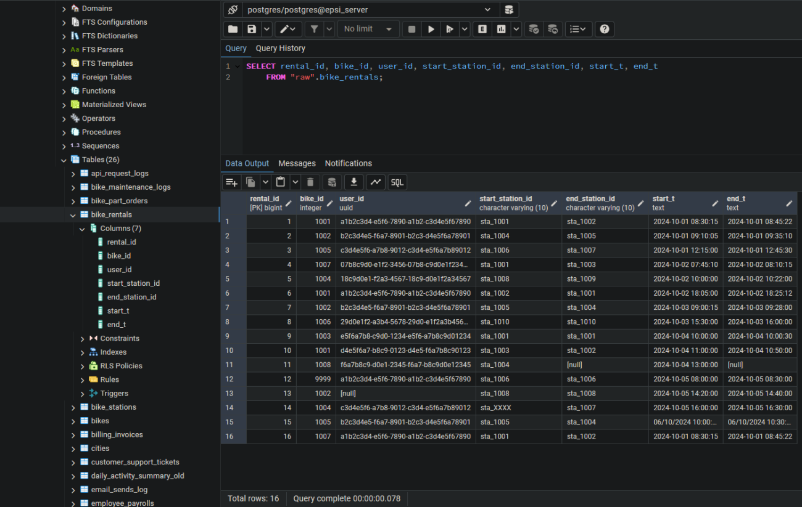
</p>

<p align="center">
  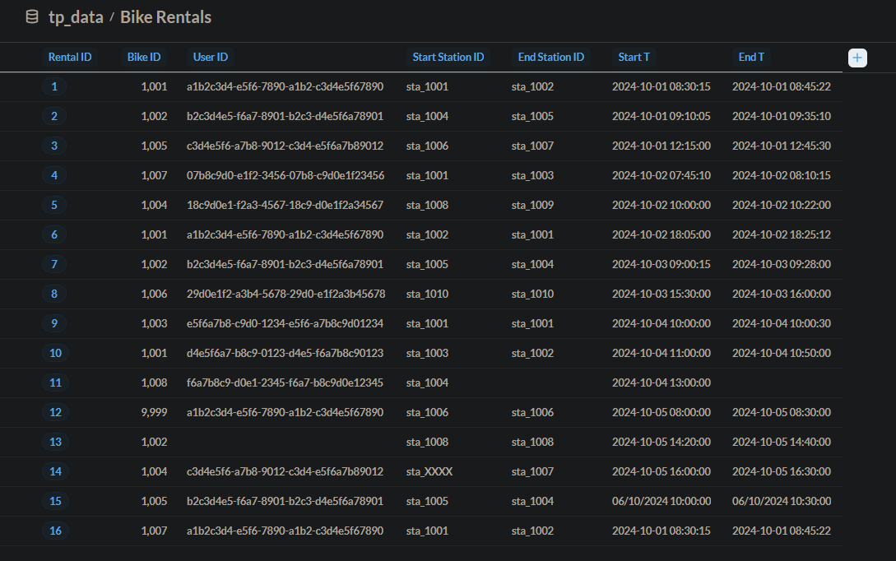
</p>

Nous avons relevés des anomalies potentielles (doublons, manque de données ou "null" ou "inconnu", problème de nommage de colonne, IDs non standard, type hétérogène, dates au format texte/timestamp mixte...).  

Exemple :

<p align="center">
  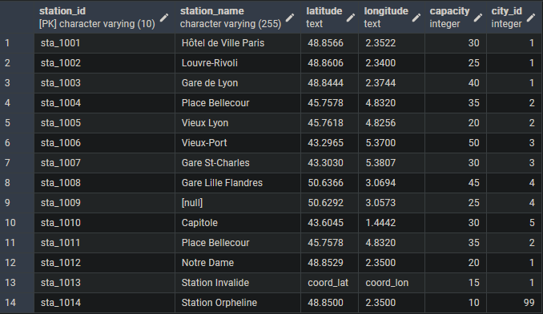
</p>

Puis nous avons réalisé un tableau reccueillant les différentes anomalies pour les tables que nous avons sélectionnées :

| Table | Anomalies Principale | Correction à appliquer |  
| ----- | -------------------- | ---------------------- |  
| bike_maintenance_logs | Dates au format texte/timestamp mixte | Cast en DATE standard |
| bikes | "Types hétérogènes (""E-bike"" vs ""Electrique"")" | Standardisation via CASE WHEN |  
| bikes_rentals | Trajets < 2 min et IDs non standards | Filtre durée & Renommage colonnes |  
| bikes_station | "Lat/Lon en texte, Ville 99, Doublons" | Nettoyage Regex & suppression orphelins |  
| cities | Régions vides | "Remplacement par ""Region Inconnue"" |  
| daily_activity | Colonne date mal nommée | Renommage |  
| marketing_campaigns | Budgets vides | Remplacement par 0 |  
| rental_archives | Trajets < 2 min et IDs non standards | Filtre durée & Renommage colonnes |  
| subscriptions | Types d'abo vides | "Valeur par défaut ""Standard"" |  
| user_accounts | Dates FR/EN mélangées | Parsing intelligent avec Regex |  
| user_session_logs | Appareils inconnus | "Remplacement par ""unknown"" |  
| weather_forecast_hourly | Précipitations NULL | Remplacement par 0 |  

Nous avons ensuite créé un nouveau schéma pour les transformations avec la commande SQL suivante :

```
CREATE SCHEMA IF NOT EXISTS analytics_le_roux_boisgontier;
```

<p align="center">
  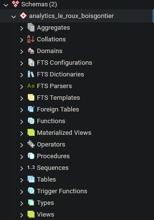
</p>

### 2. Couche Silver (raffinage)

Afin de nettoyer, typer et standardiser les données brutes pour qu'elles soient exploitables, nous avons créé une table nettoyée avec conversions de types, corrections de valeurs manquantes ou aberrantes, et ajouts de calculs métiers (durée, statuts, etc.).

***Cf. le fichier script SQl_unique.sql qui contient la création des schémas, tables, transformations et commandes GRANT et REVOKE pour les accès.***

Nous avons requêté en amont PostgreSQL afin de lister les tables présentes pour notre script SQL :

```
SELECT table_schema, table_name 
FROM information_schema.tables 
WHERE table_schema NOT IN ('information_schema', 'pg_catalog')
ORDER BY table_schema, table_name;
```

### 3. Couche Gold (Agrégation métier)

Afin de créer une table prête à l'emploi pour le Dashboard et répondant au besoin métier, nous avons créé une table avec les métriques clefs agrégées au bon niveau (jour, ville, type vélo etc.) :  totalrentals, averagedurationminutes, uniqueusers, etc :

```
CREATE TABLE analytics_le_roux_boisgontier.gold_daily_activity AS
SELECT
    -- 1. Dimensions (Axes d'analyse)
    DATE(r.start_time) AS rental_date,       -- Granularité : Jour 
    c.city_name,                             -- Granularité : Ville 
    s.station_name,                          -- Granularité : Station 
    b.bike_type,                             -- Granularité : Type de vélo 
    sub.sub_type AS subscription_type,       -- Granularité : Abonnement 

    -- 2. Métriques (KPIs)
    COUNT(r.id) AS total_rentals,                        -- Nombre total de locations [cite: 44]
    ROUND(AVG(r.duration_minutes)::numeric, 2) AS average_duration_minutes, -- Durée moyenne [cite: 45]
    COUNT(DISTINCT r.user_id) AS unique_users            -- Utilisateurs uniques [cite: 45]

FROM 
    -- Table de faits (Silver)
    analytics_le_roux_boisgontier.bikes_rentals r
    
    -- Jointures vers les dimensions (Silver)
    JOIN analytics_le_roux_boisgontier.bikes b ON r.bike_id = b.bike_id
    JOIN analytics_le_roux_boisgontier.bikes_station s ON r.station_start_id = s.station_id
    JOIN analytics_le_roux_boisgontier.cities c ON s.city_id = c.city_id
    JOIN analytics_le_roux_boisgontier.user_accounts u ON r.user_id = u.user_id
    JOIN analytics_le_roux_boisgontier.subscriptions sub ON u.sub_id = sub.sub_id

GROUP BY
    DATE(r.start_time),
    c.city_name,
    s.station_name,
    b.bike_type,
    sub.sub_type;

-- Vérification rapide du résultat
SELECT * FROM analytics_le_roux_boisgontier.gold_daily_activity LIMIT 10;
```

<p align="center">
  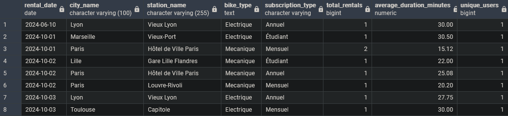
</p>

---

## Partie 3 : Visualisation (Metabase)

### 1. Connexion à Metabase & 2. Source de données

Afin de créer un Dashboard simple pour le métier Marketing, nous :

* nous sommes connectés à Metabase
* avons ajouté la base PostgreSQL comme source
* avons ajouté la table *analytics_le_roux_boisgontier.gold_daily_activity* comme dataset dans Metadata

<p align="center">
  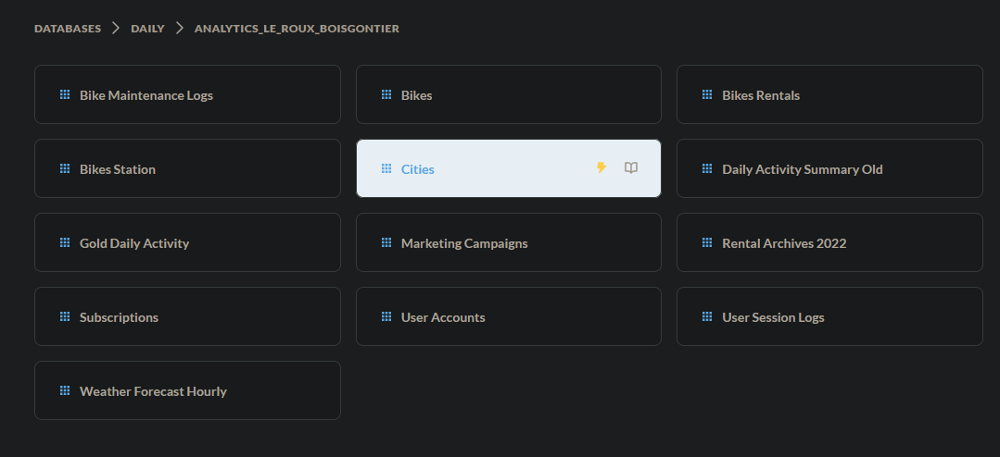
</p>

### 3. Création des charts & 4. Dashboard

Nous avons créé les trois charts suivants :

* Chart 1 (Courbe) : Évolution du total_rentals dans le temps (axe X = jour). 
* Chart 2 (Bar) : Top 3 des villes par total_rentals. 
* Chart 3 (Indicateur/KPI) : average_duration_minutes par ville. 

Et avons construit un dashboard "Suivi Activité VéloCity" à partir de ces charts :

<p align="center">
  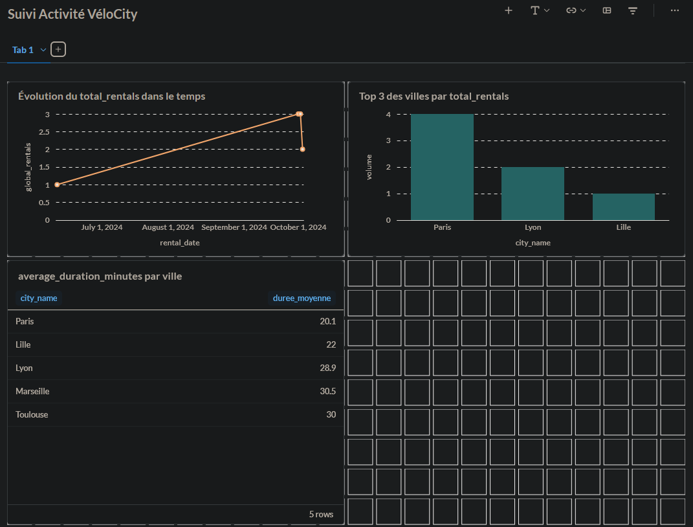
</p>

---

## Partie 4 : Sécurité et Gouvernance (PostgreSQL + )

### 1. Scénario & 2. Audit (Simulation)

Si marketing_user essaie de faire `SELECT * FROM raw.user_accounts;`, il a le message *permission denied* et ne peut pas accéder aux données.

<p align="center">
  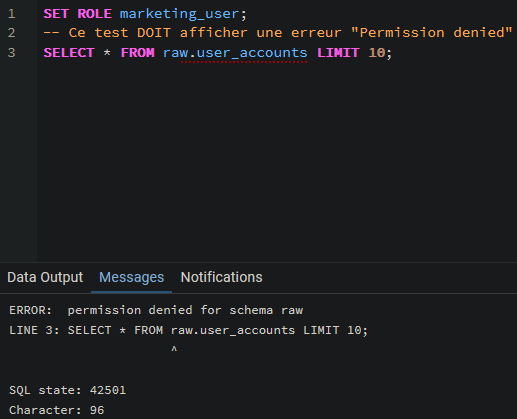
</p>

Si marketing_user fait `SELECT * FROM analytics_nom1_nom2.gold_daily_activity;`, il a accès aux données de la table *analytics_nom1_nom2.gold_daily_activity* uniquement.

<p align="center">
  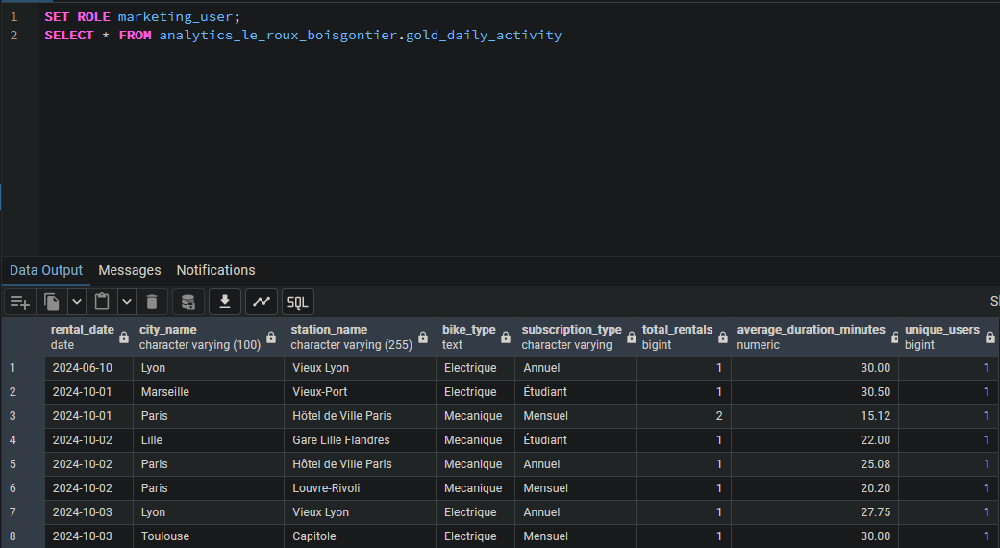
</p>

### 3. Tâche (Script SQL)

Nous avons écrit un script SQL pour :

* Implémenter cette règle de sécurité
* Créer un rôle manager_lyon
* Ne lui donner accès qu’à la table GOLD, pour la ville ‘Lyon’

***Cf. le fichier script SQl_unique.sql qui contient la création des schémas, tables, transformations et commandes GRANT et REVOKE pour les accès.***

Puis nous avons testé le rôle pour nous assurer que celui-ci fonctionne bien comme convenu.

<p align="center">
  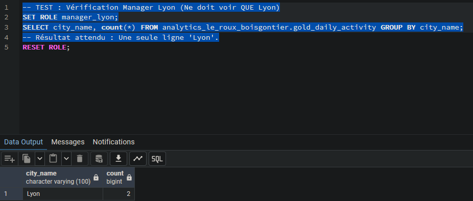
</p>